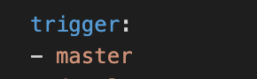

## Q1 - SCENARIO
1) The build should trigger as soon as anyone in the dev team checks in code to master branch.

This can be achieved by simply making the main repository have the `azure-pipelines.yml` file to define the trigger step as follows:

